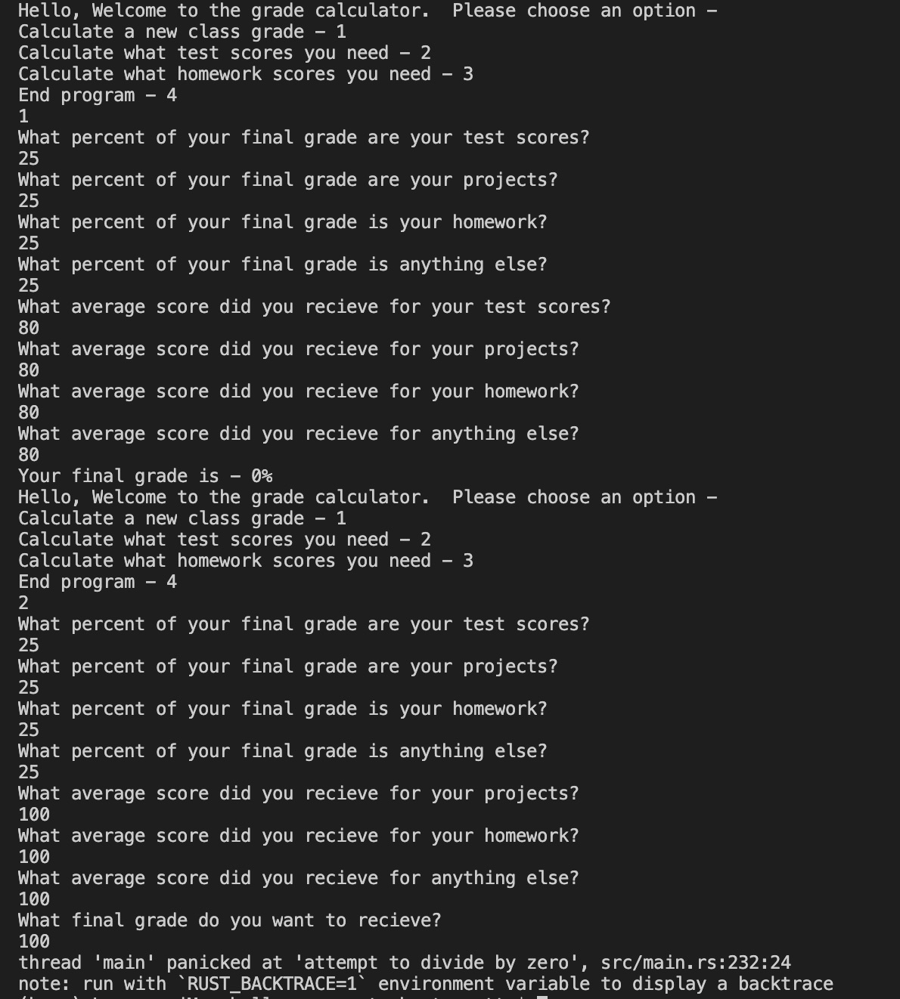
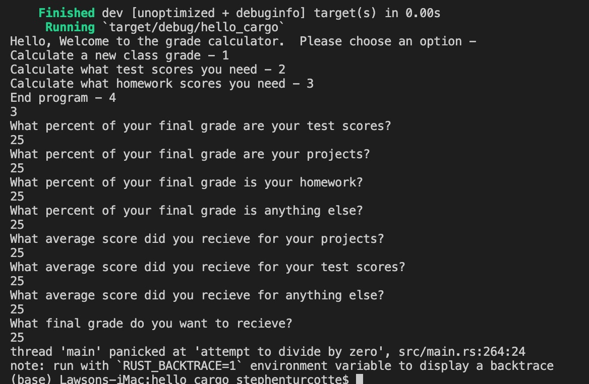

# Grade Calculator

## Overview

This program runs a grade calculator using weighted averages to calculate either a total final grade or what scores are needed in either homework or tests to get a specified grade.  

## Development Environment
* Visual Studio Code
* Rust
* Cargo

## Execution
To use this program download the files, Rust, and cargo, Rust's build system and package manager.  Running the program will give the following three outputs -

So there is no division going on, much less by zero, and there are numbers going into part one's final output, so I am convinced that Rust doesn't math very well.

## Useful Websites
* https://doc.rust-lang.org/book/title-page.html